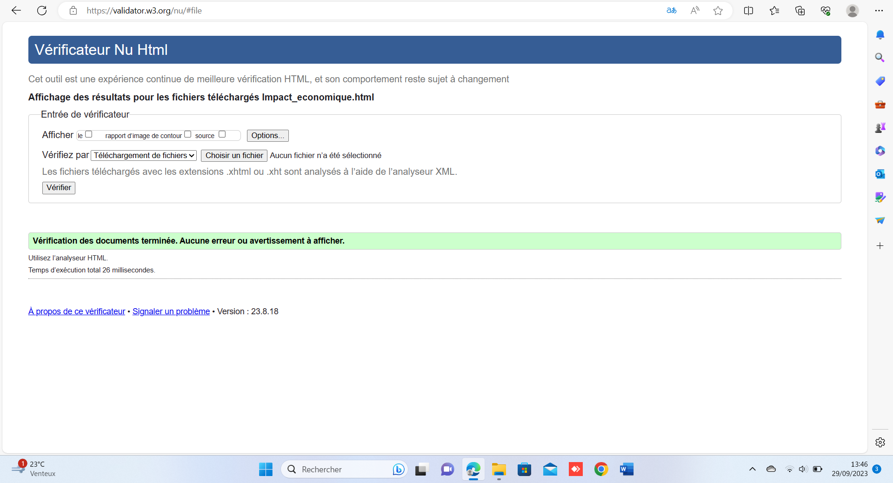
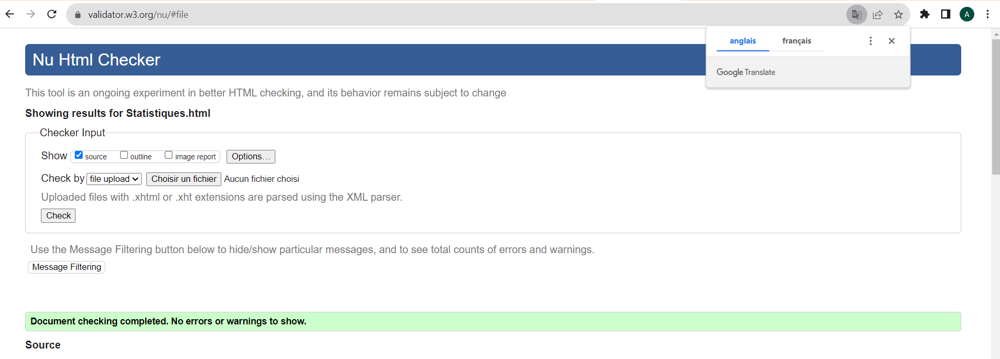

# s1-2023-ihm

## Sujet    

[S1-2023-ihm](https://login.github.io/projet/)

## Membres du groupe :

- [AZONNOUDO Dènadi Aurélie (référent)](mailto:denadi_aurelie.azonnoudo@edu.univ-fcomte.fr?subject=SAE_1_05_06)  
- [Aminata Oumou Rassoul Ngom](mailto:aminata_oumou_rassou.ngom@edu.univ-fcomte.fr?subject=SAE_1_05_06)   
- [James Genitrini](mailto:james.genitrini@edu.univ-fcomte.fr?subject=SAE_1_05_06)
- [Johan Lancon](mailto:johan.lancon@edu.univ-fcomte.fr?subject=SAE_1_05_06)   

## Présentation 

Ce dépôt correspond à un site web créé en HTML/CSS/JS dans le cadre de la SAÉ 05-06 à l'IUT de Belfort-Montbéliard.
Ce site présente des informations concernant l'entreprise ATOS et sert de vitrine pour présenter l'entreprise, ses activités,
son organisation et son historique. Vous trouverez dans ce dépôt et sur le site un rapport économique analysant l'aspect économique d'ATOS. 

## Choix de conception  

Pour la conception du site, nous nous sommes grandement inspirés du site officiel d'ATOS(disponible [ici](https://www.atos.com/fr-fr/)),
et d'autres sites comme celui du gouvernement de la france disponible ici pour les boutons.    

## Développement Site Web et Validation des pages

### Page d'accueil

**Auteur : Johan Lançon**  

Vérification W3C : [https://validator.w3.org/check?url=https://(https://jgenitri-iut90.github.io/s1-2023-ihm/index.html)](https://jgenitri-iut90.github.io/s1-2023-ihm/index)
                   [https://validator.w3.org/check?url=https://(https://jgenitri-iut90.github.io/s1-2023-ihm/en_index.html)](https://jgenitri-iut90.github.io/s1-2023-ihm/en_index)
                             

ou 

<!--  style="width=400px" ne fonctionne pas -->

### Histoire

**Auteur : Johan Lançon**  

Verification W3C : [Détail ICI](https://validator.w3.org/nu/?showsource=yes&showoutline=yes&showimagereport=yes&doc=https%3A%2F%2Fdemo-am90.github.io%2Fs1-demo%2Findex.html)

 

### Services

**Auteur : James Genitrini**

Verification W3C : [Détail ICI](https://jgenitri-iut90.github.io/s1-2023-ihm/Services.html)

 

### Impact économique

**Auteur : Aminata Oumou Rassoul Ngom**

Verification W3C : [Détail ICI]([https://jgenitri-iut90.github.io/s1-2023-ihm/Services.html](https://validator.w3.org/nu/?doc=https%3A%2F%2Fjgenitri-iut90.github.io%2Fs1-2023-ihm%2FImpact_economique.html))

 

### Statistiques

**Auteur : Azonnoudo Dènadi Aurélie**

Verification W3C : [Détail ICI]([https://jgenitri-iut90.github.io/s1-2023-ihm/Statistiques.htm](https://validator.w3.org/nu/?showsource=yes&doc=https%3A%2F%2Fjgenitri-iut90.github.io%2Fs1-2023-ihm%2FStatistiques.html)

capture d'écran de validation

## Répartition du travail``

### Planification - Diagramme de GANTT

- Azonnoudo dènadi aurélie

### Recherches d'informations

- Azonnoudo Dènadi Aurélie
- Johan Lancon
- James Genitrini
- Aminata Oumou Rassoul Ngom

### Rapport économique

- Azonnoudo Dènadi Aurélie
- Johan Lancon
- James Genitrini
- Aminata Oumou Rassoul Ngom

### Développement site

- Johan Lançon -->
  - Page d’accueil
  - Page présentation

- James Genitrini -->
  - Footer
  - Page services

- Aminata Oumou Rassoul Ngom -->
  - Page impact économique

- Azonnoudo Denadi Aurelie -->
  - Page statistiques
